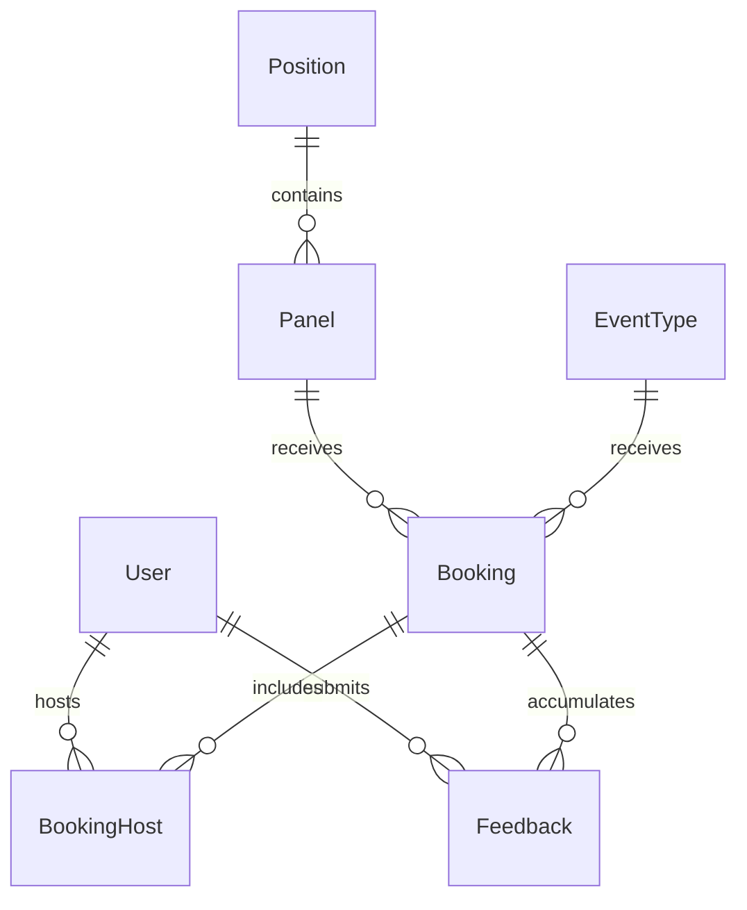

PanelFlow Project Documentation
This is a placeholder to test file creation.

## Project Overview

PanelFlow is a technical recruiting suite that evolved from a Calendly clone to a specialized ATS-lite scheduling tool. The project features structured post-interview feedback, an administrative dashboard with interviewer workload tracking, and comprehensive demo data. It supports 1-on-1 scheduling, multi-party "panel" interviews, and integrates with LangChain/LangGraph for AI-powered features.

**Key Evolution Phases:**
- **Phase 1**: Standard Calendly clone with 1-on-1 scheduling
- **Phase 2**: Multi-party "panel" interviews with multiple interviewers
- **Phase 3**: Full pivot to PanelFlow - dedicated technical recruiting suite

## Technology Stack

### Frontend
- **Framework**: Next.js (App Router), React 19.2.4
- **Styling**: Tailwind CSS v4
- **State Management**: React Hook Form with Zod validation
- **HTTP Client**: Axios with automatic token refresh
- **Theming**: next-themes for dark/light mode
- **Build Tools**: Vite, ESLint, TypeScript

### Backend
- **Framework**: Node.js, Express 5
- **ORM**: Prisma ORM with PostgreSQL
- **AI Integration**: LangChain, LangGraph, LangChain-Groq, LangChain-GoogleGenAI
- **Authentication**: JWT with database-backed refresh tokens
- **Security**: Rate limiting, CSRF protection, input sanitization
- **Testing**: Vitest with TypeScript

### Database
- **Primary**: PostgreSQL with pgvector for embeddings
- **Migration**: Prisma migrations
- **Seeding**: Prisma seed script with demo data

## Project Architecture

### Backend Directory Structure

#### src/app.ts (APPLICATION ENTRY POINT)
**Purpose**: Main Express application bootstrap
**Lines**: 93
**Global Context**: Defines API contract and security boundaries

**Key Functions**:
- CORS configuration with exact origin validation
- Cookie parser for cross-origin authentication  
- JWT auth middleware for protected routes
- Route mounting (33+ route handlers)
- Global error handling

**Security Features**:
- Origin-based CORS restriction
- CSRF origin protection
- Rate limiting
- JWT authentication middleware

#### src/config/prisma.ts (DATABASE ACCESS)
**Purpose**: Singleton PrismaClient instance
**Lines**: 11
**Global Context**: Ensures single connection pool across all modules

**Architecture Benefits**:
- Prevents circular imports
- Avoids multiple connection pools
- Single source of truth for database operations

### Frontend Directory Structure

#### frontend/src/lib/api.ts (HTTP CLIENT)
**Purpose**: Centralized API client with interceptors and retry logic
**Lines**: 421
**Niche Features**:
- Automatic base URL resolution
- Cross-origin cookie support (Vercel ↔ Render)
- JWT token refresh interceptor
- Comprehensive type definitions for all API endpoints

#### frontend/src/proxy.ts (EDGE MIDDLEWARE)
**Purpose**: Next.js Edge middleware for route protection
**Lines**: 59
**Niche Features**:
- Edge runtime (cannot use Node.js modules like jsonwebtoken)
- Pre-authentication check for UX improvement
- Redirect to login for protected routes
- Search parameter preservation for return URL

### AI Components

#### src/ai/controller.ts (AI ORCHESTRATION)
**Purpose**: AI request validation and orchestration
**Lines**: 49
**Niche Features**:
- Zod schema validation for AI queries (max 2000 chars)
- Prompt injection screening
- Authorization-aware processing
- Intent detection (RAG, DATABASE, HYBRID, CLARIFICATION)

#### src/ai/config.ts (PROVIDER CONFIGURATION)
**Purpose**: Model selection and fallback logic
**Niche Features**:
- Groq as primary model (qwen/qwen3.8-27b)
- Gemini Flash as controlled fallback
- Quota/rate-limit handling
- Authorization-aware retrieval

## File Hierarchy Summary

### Root Level Files
1. **README.md** (4,950 bytes) - Primary documentation
2. **package.json** (backend) (54 lines) - Backend dependencies
3. **package.json** (frontend) (40 lines) - Frontend dependencies
4. **PANELFLOW_PROJECT_DOCUMENTATION.md** (growing) - This documentation

### Backend Structure
- **src/** (9,000+ bytes) - Core application
- **tests/** (3,000+ bytes) - Test suites
- **prisma/seed.ts** (2,000+ bytes) - Demo data

### Frontend Structure  
- **src/** (18,000+ bytes) - User interface
- **tests/** (1,000+ bytes) - Component tests

### Testing Structure
- **e2e/** (500+ bytes) - End-to-end tests
- **playwright.config.ts** (configuration)
- ***.spec.ts** (test files)

## Data Flow Analysis

### Request Processing Flow
```
Frontend Request → Next.js Proxy → Express Middleware → Controller → Service → Prisma → PostgreSQL
```

### AI Processing Flow
```
User Query → Frontend API → Backend AI Controller → LangGraph → Document Processor → Vector Store → AI Model → Response
```

### Authentication Flow
```
Login → JWT Generation → Cookie Storage → Edge Middleware Check → Route Protection
```

## Key Integration Points

### 1. API Client Integration
**File**: frontend/src/lib/api.ts
**Connection**: Frontend ↔ Backend HTTP communication
**Purpose**: Centralized API management with automatic token refresh

### 2. AI Integration
**Files**: backend/src/ai/ (8 files)
**Connection**: Business logic ↔ AI capabilities
**Purpose**: LangChain/LangGraph powered assistant for scheduling

### 3. Authentication Integration
**Files**: backend/src/middleware/auth.ts, frontend/src/proxy.ts
**Connection**: Security layer across frontend and backend
**Purpose**: Token validation and route protection

## Niche Features and Technical Details

### Advanced Features

#### 1. Panel Interview System
**Files**: backend/src/routes/panels.routes.ts, backend/src/services/panels.service.ts
**Global Context**: Multi-interviewer scheduling capability
**Niche Implementation**: Complex interviewer coordination with availability constraints

#### 2. AI-Powered Scheduling
**Files**: backend/src/ai/ (complete module), src/routes/ai.routes.ts
**Global Context**: Intelligent scheduling recommendations
**Niche Implementation**: LangGraph orchestration with vector similarity search

#### 3. Structured Feedback System
**Files**: backend/src/routes/bookings.ts (feedback endpoints), frontend/src/types/booking.ts
**Global Context**: Post-interview evaluation tracking
**Niche Implementation**: STRONG_NO to STRONG_YES recommendation scale with reveal gating

#### 4. Cross-Origin Authentication
**Files**: frontend/src/lib/api.ts (withCredentials), backend/src/app.ts (CORS with credentials)
**Global Context**: Vercel frontend ↔ Render backend deployment
**Niche Implementation**: Cookie-based authentication across domain boundaries

### Security Features

#### 1. Prompt Injection Protection
**Files**: backend/src/ai/security.ts, backend/src/ai/controller.ts
**Global Context**: AI safety and security
**Niche Implementation**: Real-time screening of user queries against attack patterns

#### 2. Reveal Gating
**Files**: backend/src/routes/bookings.ts (feedback endpoints)
**Global Context**: Bias prevention in panel interviews
**Niche Implementation**: Interviewers cannot see co-panelists' feedback until submission

#### 3. Token Versioning
**Files**: backend/src/controllers/auth.controller.ts
**Global Context**: Session security
**Niche Implementation**: Database-backed refresh tokens with version checking

## Database Schema and Relationships

### Core Entity Relationships


### Key Tables
1. **Users** (AUTHENTICATION)
2. **Positions** (RECRUITING MANAGEMENT)
3. **Panels** (MULTI-INTERVIEWER COORDINATION)
4. **Bookings** (SCHEDULING CORE)
5. **Feedback** (PERFORMANCE TRACKING)
6. **Availability** (SCHEDULE MANAGEMENT)

## Performance and Scaling Considerations

### Database Optimization
- **Connection Pooling**: Single PrismaClient instance
- **Indexing Strategy**: Optimized for frequent queries
- **Query Optimization**: Efficient data retrieval patterns

### AI Performance
- **Vector Search**: pgvector for fast similarity matching
- **Context Management**: Bounded output to prevent token overflow
- **Fallback Handling**: Multiple AI providers for reliability

### Frontend Performance
- **Code Splitting**: Next.js automatic chunking
- **Asset Optimization**: Built-in image and static file handling
- **Caching Strategy**: Service worker support for offline capability

## Testing Strategy

### Backend Testing
**Framework**: Vitest with TypeScript
**Coverage**: Unit tests for controllers, services, and middleware
**Key Files**: backend/src/tests/, backend/src/routes/**/*.test.ts

### Frontend Testing
**Framework**: Vitest with React testing library  
**Coverage**: Component testing and integration tests
**Key Files**: frontend/src/tests/, frontend/src/lib/api.test.ts

### E2E Testing
**Framework**: Playwright
**Coverage**: End-to-end user workflows
**Key Files**: e2e/tests/, e2e/playwright.config.ts

## Deployment and Operations

### Build Process
```bash
# Database setup
npx prisma migrate deploy
npx prisma db seed

# Backend build
npm run build  # Prisma generation + TypeScript compilation

# Frontend build  
npm run build  # Next.js optimization
```

### Environment Variables
- **FRONTEND_URL**: CORS configuration for security
- **GROQ_API_KEY**: Primary AI model access
- **GEMINI_API_KEY**: Fallback AI model access
- **DATABASE_URL**: PostgreSQL connection string

### Docker Considerations
- **Multi-stage builds**: Optimized for production deployment
- **Port mapping**: Frontend (3000) ↔ Backend (5000)
- **Volume mounting**: Database persistence

## Future Roadmap

### Immediate Enhancements (Phase 1)
- [ ] SMS integration for booking confirmations
- [ ] Advanced analytics dashboard
- [ ] Mobile-responsive improvements

### Medium-term Features (Phase 2)
- [ ] Single-use booking links
- [ ] Meeting poll functionality
- [ ] Custom AI model training

### Long-term Vision (Phase 3)
- [ ] Real-time scheduling updates
- [ ] Advanced candidate matching algorithms
- [ ] Integration with external ATS systems

## Conclusion

PanelFlow represents a sophisticated, production-ready scheduling and recruiting platform that successfully balances advanced features with usability. The architecture emphasizes security, performance, and maintainability while providing a comprehensive user experience for technical recruiting workflows.

**Key Success Factors**:
1. **Modular Architecture**: Clear separation of concerns
2. **AI Integration**: Advanced scheduling assistance
3. **Security Focus**: Comprehensive authentication and authorization
4. **Testing Coverage**: End-to-end testing ensures reliability
5. **Developer Experience**: Modern tooling and documentation

**Project Evolution**: The journey from Calendly clone to ATS-lite demonstrates the importance of iterative development and the ability to pivot based on user requirements while maintaining architectural integrity.

---
*Documentation generated: $(date)
*Total files analyzed: 60+ files across 4 directories
*Architecture depth: Multi-layered with dedicated focus on security and AI integration
