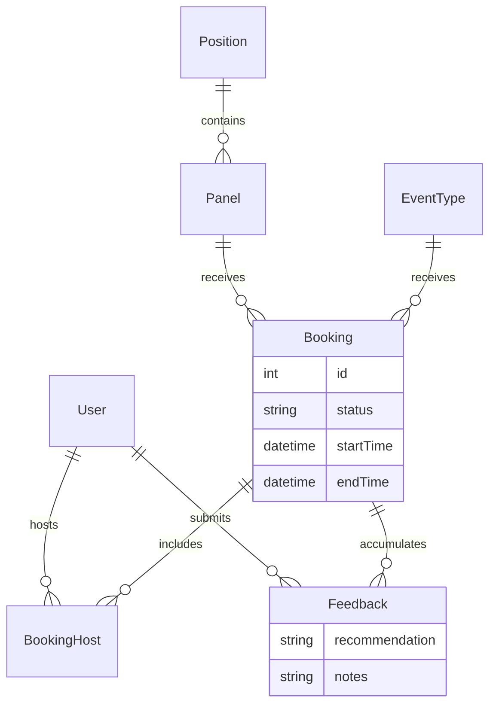

# PanelFlow

**From Calendly-clone to PanelFlow: The Pivot**

This project initially began as a standard Calendly clone (Phase 1) focused on 1-on-1 scheduling, availability management, and automated booking logic. As the requirements evolved (Phase 2), we introduced multi-party "panel" interviews where an organization could schedule candidates with multiple interviewers simultaneously. Ultimately, in Phase 3, the project pivoted fully into **PanelFlow**: a specialized ATS-lite scheduling tool. It now features structured post-interview feedback, an administrative dashboard with interviewer workload tracking, and comprehensive demo data, transforming it from a general-purpose booking app into a dedicated technical recruiting suite.

## Features

| Area | Feature | Description |
|---|---|---|
| **Scheduling** | 1-on-1 Events | Traditional scheduling with customizable duration, buffer times, and recurring availability rules. |
| | Panel Interviews | Admin-configured multi-interviewer panels linked to Job Positions. Candidates book time with a group. |
| | Single-Use Links | One-time booking links that expire after a single use. |
| | Meeting Polls | Propose multiple times to attendees and let them vote on the best slot. |
| **Automation** | Email Notifications | Automated confirmation, cancellation, and reminder emails via Resend. |
| | Webhooks | Developer hooks (e.g. `booking.created`, `feedback.submitted`) with HMAC-SHA256 signature verification. |
| | Reminders (Cron) | Scheduled jobs checking for upcoming meetings to dispatch 24h/1h reminders. |
| **Admin & Feedback**| Feedback System | Interviewers submit structured (STRONG_NO to STRONG_YES) feedback + notes after a booking. |
| | Reveal Gating | To prevent bias, interviewers cannot see co-panelists' feedback until they submit their own. |
| | Workload Widget | Admins can view a breakdown of how many interviews each interviewer has conducted in the last 30 days. |
| | Candidate History | Admins can view an aggregated history of a candidate's interviews and feedback counts across a position. |

## Tech Stack

- **Frontend**: Next.js (App Router), React, Tailwind CSS, Axios
- **Backend**: Node.js, Express, Prisma ORM
- **Database**: PostgreSQL
- **Email**: Resend API
- **Cron**: node-cron (for scheduled reminder checks)

## Architecture



## Known Limitations

- **Authentication**: Uses stateless JWTs in `httpOnly` cookies. There is no refresh token mechanism; tokens must expire and force a re-login.
- **Email Delivery**: Powered by Resend. Unless a custom domain is verified in the Resend dashboard, emails can only be sent to the registered owner's email address.
- **SMS**: Not implemented in this version; only email notifications are supported.
- **Timezones**: Currently standardized around a primary timezone (often IST in demo data), though the data model stores everything in UTC. Real-world scaling requires robust localized timezone formatting on the frontend.
- **Cron Execution**: The cron job runs within the same Node process. In a multi-instance deployment, this would cause duplicate reminders unless moved to a distributed task runner (e.g., BullMQ) or an external cron service calling an endpoint.

## Try It

You can run the full demo locally. The backend comes with a pre-configured seed script that populates realistic positions, panels, users, and past/future bookings.

1. Setup the database and run the seed:
   ```bash
   cd backend
   npx prisma db push
   npx prisma db seed
   ```
2. Start the backend: `npm run dev`
3. Start the frontend: `cd frontend && npm run dev`
4. Navigate to `http://localhost:3000/login`

**Demo Credentials**:
On the login page, you can simply click the **"Autofill Admin Credentials"** button to log in instantly.
- Admin: `om@example.com` / `password123`
- Interviewer: `alice@example.com` / `password123`
- Interviewer: `bob@example.com` / `password123`

*(Screenshots to be added here manually post-deployment)*
