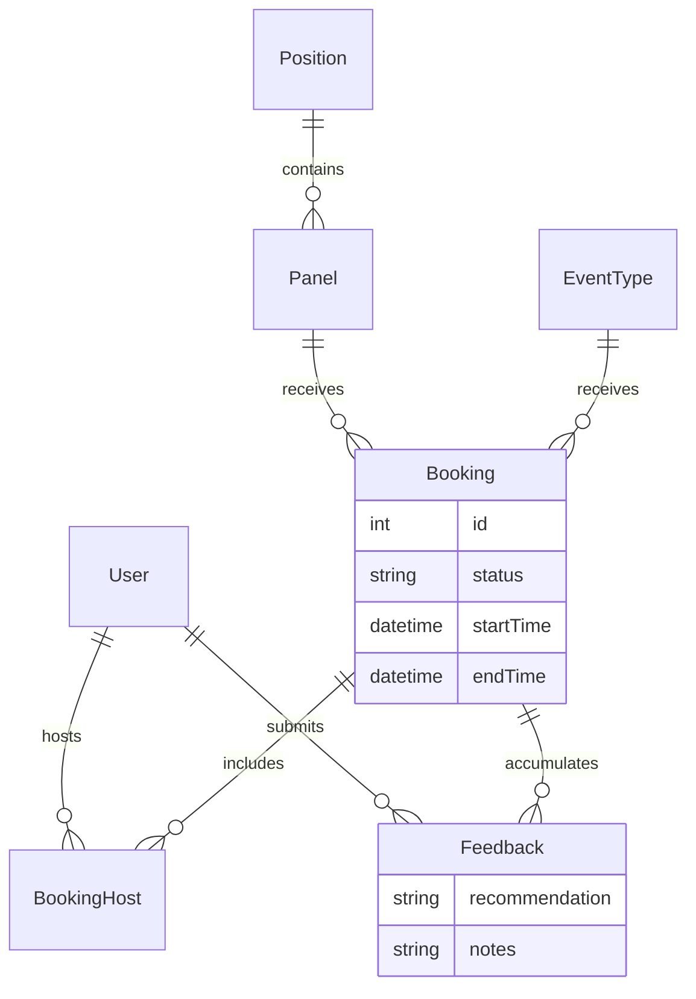

# PanelFlow

**From Calendly-clone to PanelFlow: The Pivot**

This project initially began as a standard Calendly clone (Phase 1) focused on 1-on-1 scheduling, availability management, and automated booking logic. As the requirements evolved (Phase 2), we introduced multi-party "panel" interviews where an organization could schedule candidates with multiple interviewers simultaneously. Ultimately, in Phase 3, the project pivoted fully into **PanelFlow**: a specialized ATS-lite scheduling tool. It now features structured post-interview feedback, an administrative dashboard with interviewer workload tracking, and comprehensive demo data, transforming it from a general-purpose booking app into a dedicated technical recruiting suite.

## Features

| Area | Feature | Description |
|---|---|---|
| **Scheduling** | 1-on-1 Events | Traditional scheduling with customizable duration, buffer times, and recurring availability rules. |
| | Panel Interviews | Admin-configured multi-interviewer panels linked to Job Positions. Candidates book time with a group. |
| | Single-Use Links | Planned; not currently available in the UI. |
| | Meeting Polls | Planned; not currently available in the UI. |
| **Admin & Feedback**| Feedback System | Interviewers submit structured (STRONG_NO to STRONG_YES) feedback + notes after a booking. |
| | Reveal Gating | To prevent bias, interviewers cannot see co-panelists' feedback until they submit their own. |
| | Workload Widget | Admins can view a breakdown of how many interviews each interviewer has conducted in the last 30 days. |
| | Candidate History | Admins can view an aggregated history of a candidate's interviews and feedback counts across a position. |

## Tech Stack

- **Frontend**: Next.js (App Router), React, Tailwind CSS, Axios
- **Backend**: Node.js, Express, Prisma ORM
- **Database**: PostgreSQL

## Architecture


```mermaid
erDiagram
    User ||--o{ BookingHost : hosts
    User ||--o{ Feedback : submits
    Position ||--o{ Panel : contains
    Panel ||--o{ Booking : receives
    EventType ||--o{ Booking : receives
    Booking ||--o{ BookingHost : includes
    Booking ||--o{ Feedback : accumulates

    Booking {
        int id
        string status
        datetime startTime
        datetime endTime
    }
    Feedback {
        string recommendation
        string notes
    }
```

### AI / RAG

PanelFlow now includes an authorization-aware AI assistant built as an extension of the existing backend. It uses LangGraph for explicit orchestration, LangChain for chunking/embeddings/vector retrieval, and PostgreSQL + pgvector for the vector index. The source of truth remains Prisma/PostgreSQL. See `backend/src/ai/README.md` for setup, index rebuild, authorization, and maintenance details.

## Known Limitations

- **Authentication**: Access JWTs are checked against the current user token version. Refresh tokens are database-backed, rotated on use, and revoked at logout.
- **Rate limiting**: The included limiter is process-local; multi-instance deployments require a shared rate-limit store.
- **Deployment sequencing**: Apply Prisma migrations before deploying the application version that requires them. The current migrations are additive; rollback application code only after confirming the schema remains compatible. Do not roll back database migrations automatically in production.
- **SMS**: Not implemented in this version.
- **Timezones**: Availability schedules are stored in their declared IANA timezone. Bookings are UTC timestamps and are displayed in the relevant viewer timezone.

## Try It

You can run the full demo locally. The backend comes with a pre-configured seed script that populates realistic positions, panels, users, and past/future bookings.

1. Setup the database and run the seed:
   ```bash
   cd backend
   npx prisma migrate deploy
   npx prisma db seed
   ```
2. Start the backend: `npm run dev`
3. Start the frontend: `cd frontend && npm run dev`
4. Navigate to `http://localhost:3000/login`

**Demo Credentials**:
On the login page, you can simply click the **"Autofill Admin Credentials"** button to log in instantly.
- Admin: `om@example.com` / `password123`
- Interviewer: `alice@example.com` / `password123`
- Interviewer: `bob@example.com` / `password123`

*(Screenshots to be added here manually post-deployment)*


## PanelFlow AI provider setup

PanelFlow AI uses Groq with `qwen/qwen3.8-27b` as its primary model and Gemini Flash as a controlled fallback for quota/rate-limit/transient Groq failures. Copy `backend/.env.example` to your local environment and set `GROQ_API_KEY`; adding `GEMINI_API_KEY` enables fallback operation.

The AI endpoint is deliberately scoped to PanelFlow tasks rather than functioning as an unrestricted chatbot. It applies prompt-injection/out-of-scope screening, authorization-aware retrieval, untrusted-context handling, bounded output, and explicit application tools for scheduling operations.
